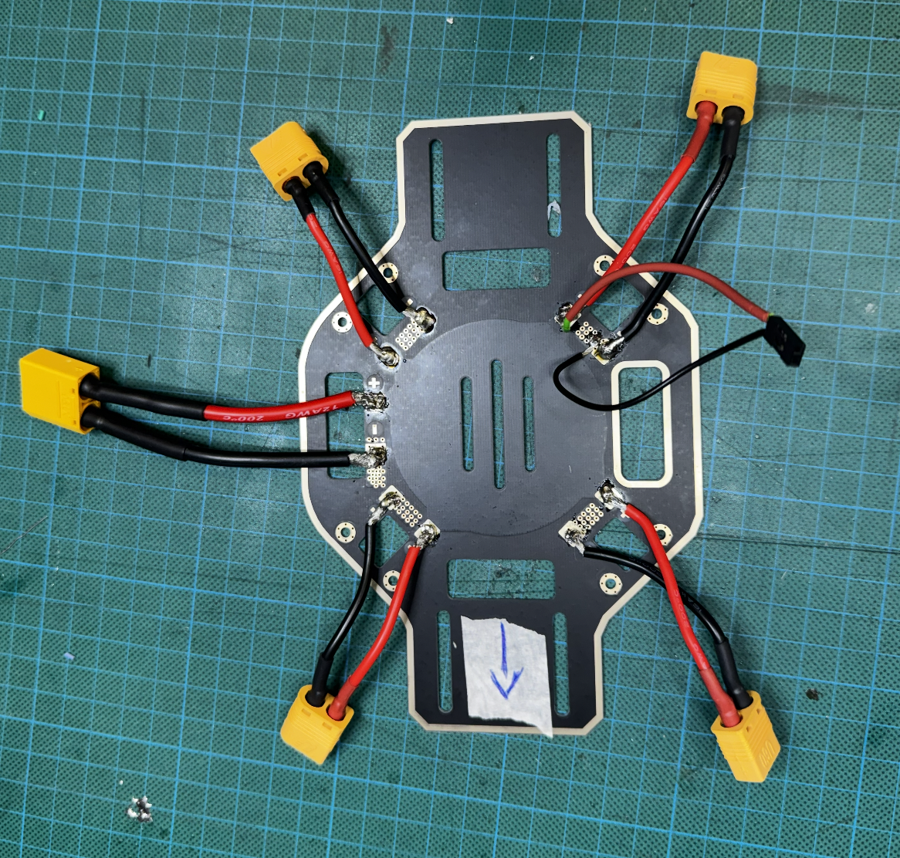
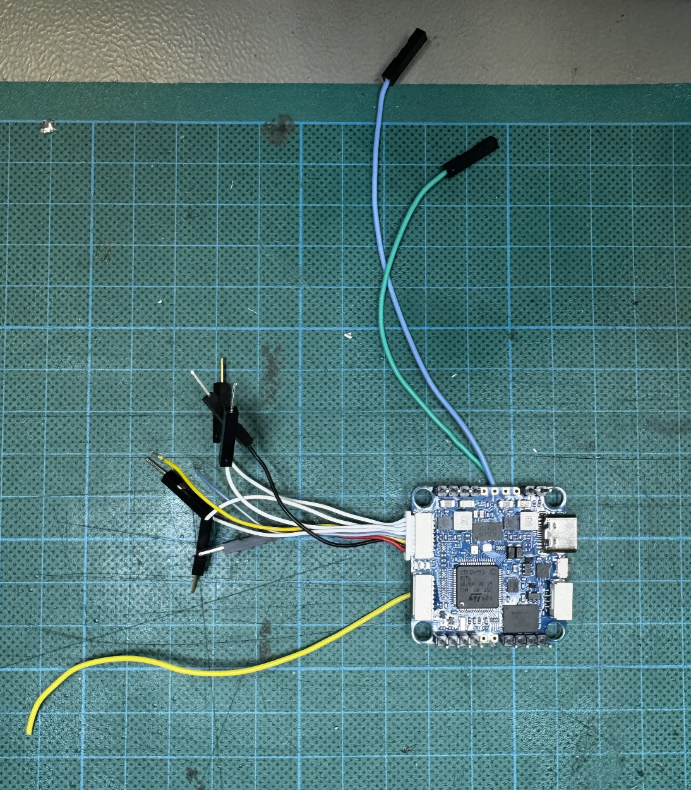
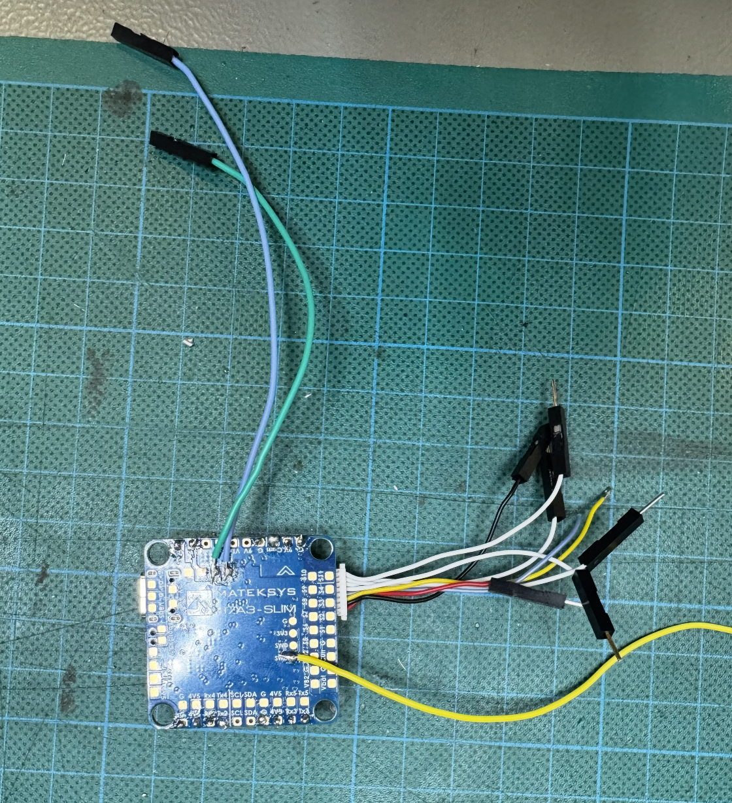

# Expected Assembly

This section outlines what the final hardware assembly should look like once all components have been mounted, wired, and secured to the frame.

## Expected Board Layout

## STM32 Flight Controller 

**Front View:**

**Back View:**

