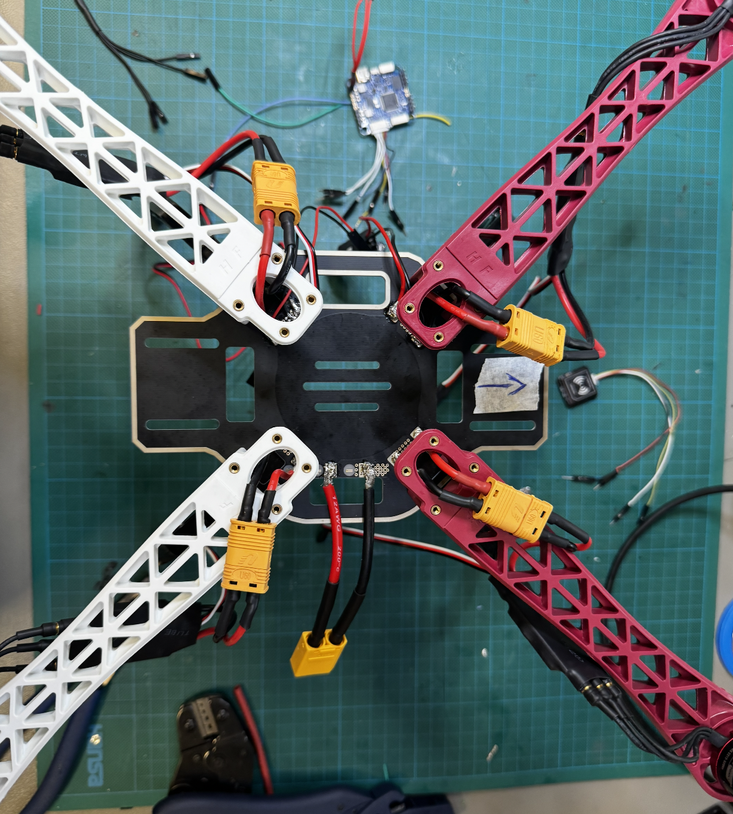

# SwarmSummerSchool 2026 Drone Documentation

Welcome to the official documentation for the SwarmSummerSchool 2026 drone project.

## 1. Executive Summary

This document serves as the official unboxing documentation, physical verification report, and preliminary architecture log for all hardware components received for the autonomous quadcopter build based on the **F450 platform**. All items displayed on the assembly staging area have been unpacked, visually inspected, logged, and categorized prior to power distribution board soldering, motor attachment, and ArduPilot software configuration.

**Audit Result:** 15 out of 15 major line items received in 100% compliant state with no shipping damage, bent header pins, or manufacturing defects.

This repository contains everything you need to know to assemble your drone, configure its software, and deploy complex algorithms (e.g., swarm behaviors, computer vision) in both simulation and the real world.

## Project Structure

This documentation is structured into three main phases:

1. **Hardware**: Learn about the components and how to put the physical drone together, including detailed guides on welding and nipping.
2. **Software & Configuration**: Flash the correct firmware, calibrate sensors, and set up the companion computer (if applicable).
3. **Algorithm Testing**: Run simulations, execute algorithms, and deploy them to real hardware.

## Quick Start

- Start by reviewing the [Bill of Materials](hardware/bom.md).

> [!TIP]
> Use the navigation bar on the left to explore the sections!

---
