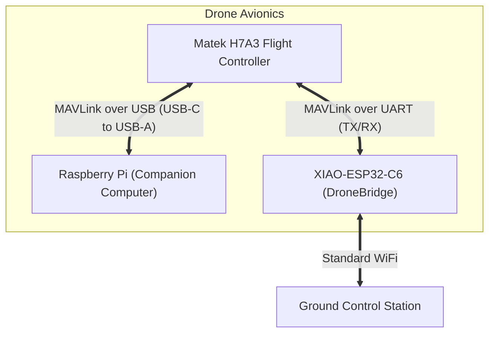

# Communication Links

## Architecture Overview

## Companion Computer (Raspberry Pi)

Connects to FC via USB-C (FC) to USB-A (Pi) for direct MAVLink access. Runs the SAR mission software. Independent of the telemetry link below.

## Wireless Telemetry Link

DroneBridge for ESP32, on a XIAO-ESP32-C6 (telemetry-only role).

Wires directly to a spare FC UART (independent of the Pi) and bridges MAVLink over standard WiFi to a ground station — replaces needing a wired/USB tether or traditional telemetry radio.
