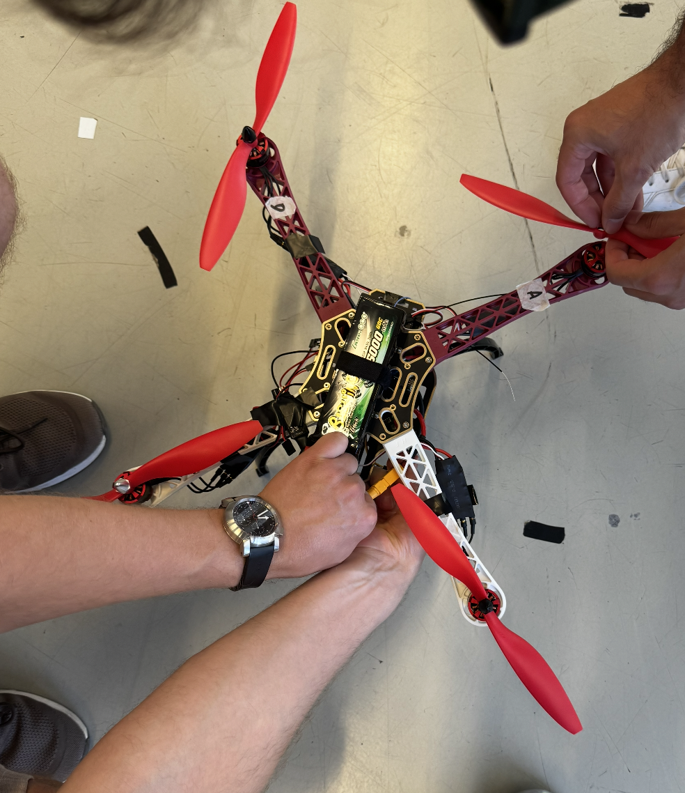
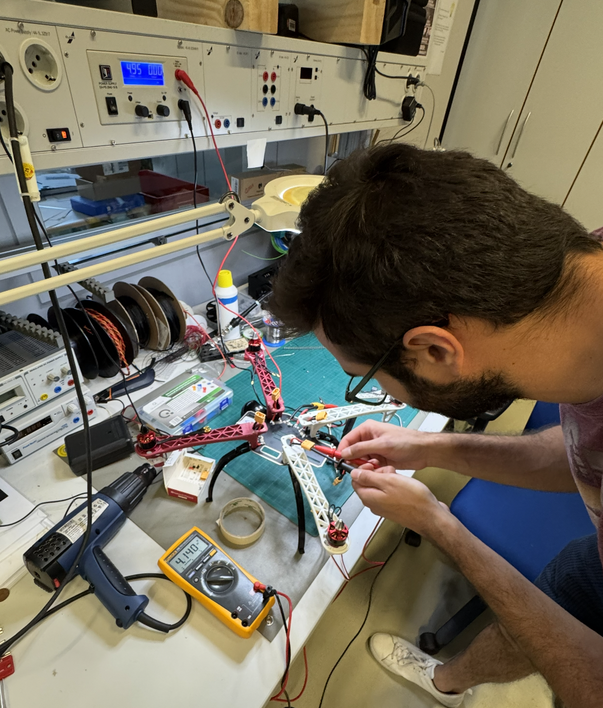

# Integration Overview

<link rel="stylesheet" href="https://cdnjs.cloudflare.com/ajax/libs/font-awesome/6.4.0/css/all.min.css">

Welcome to the Integration section. Here we will document the processes for combining hardware sub-systems and software configurations to ensure the drone is fully operational and ready for flight testing.

[**See full steps here**](connection_guide.md)

    <video controls class="w-full max-w-3xl mx-auto rounded-xl shadow-2xl border border-slate-700/50">
        <source src="../assets/Assembled_V1.mp4" type="video/mp4">
        Your browser does not support the video tag.
    </video>

## Putting Everything Together

Once the individual components have been tested (Voltage verified, Motors spinning correctly), the final integration step involves:

1. **Physical Securing**: Ensure all zip-ties are snipped flush, velcro straps are tightened around the battery, and the flight controller stack is firmly mounted on its vibration dampeners.
2. **Peripheral Connections**: Double-check that the GPS/Compass, Receiver, and Companion Computer (Raspberry Pi) are plugged into their designated UART/I2C ports securely.
3. **Telemetry & Communication Test**: Power up the drone using the 4S LiPo and verify that MAVLink telemetry is successfully transmitting to your Ground Control Station (e.g., Mission Planner).
4. **Final Center of Gravity (CoG) Check**: Lift the drone by the center of the frame and ensure it balances evenly. Adjust the battery position forward or backward if it tilts heavily.
5. **Install Propellers**: Putting the propellers on in the correct orientation (matching each motor's rotation direction) must be the absolute final piece of the integration process, done only *after* all bench testing and software configurations are complete.
    

## Voltage Verification

## Motor Spin & Direction Test

