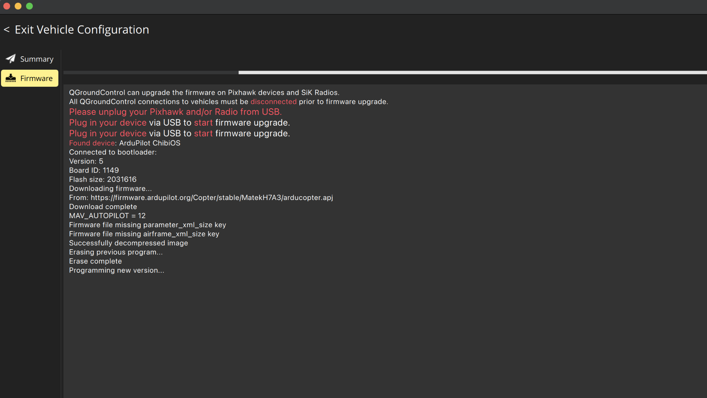
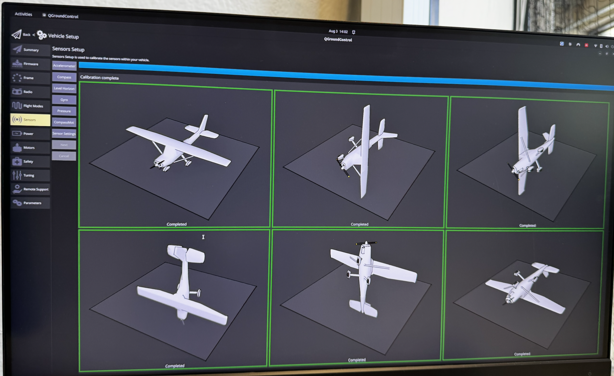

# QGroundControl & Matek H7A3-SLIM Setup

!!! info "Official ArduPilot Documentation"
    For comprehensive details on all calibration and setup steps, we highly recommend referencing the official [ArduPilot Hardware Configuration Guide](https://ardupilot.org/copter/docs/configuring-hardware.html#).
<script src="https://cdn.tailwindcss.com"></script>
<link rel="stylesheet" href="https://cdnjs.cloudflare.com/ajax/libs/font-awesome/6.4.0/css/all.min.css">
<style>
    .glass-card {
        background: rgba(15, 23, 42, 0.75);
        backdrop-filter: blur(12px);
        border: 1px solid rgba(255, 255, 255, 0.08);
        box-shadow: 0 8px 32px 0 rgba(0, 0, 0, 0.37);
    }
</style>

## 1. Board & Firmware Identification

Connecting the board to QGroundControl via USB-C and reading the MAVLink Console boot log confirmed:

```text
MatekH7A3 00410019 3231510A 31313531
ChibiOS: 8fc176ac
ArduCopter V4.6.0-dev (d2c8bdf0)
```

This is a **Matek H7A3-SLIM** flight controller (STM32H7A3RIT6 MCU) running ArduCopter (ArduPilot) — not PX4. It has no built-in compass and no built-in current sensor.

## 2. Connecting to QGroundControl

1. Install QGroundControl from qgroundcontrol.com if not already installed.
2. Connect the flight controller via USB-C directly to the computer (not through a hub).
3. QGC auto-connects within a few seconds — connection icon (top-left) goes from "Not Ready" once a link is established.
4. Gear icon (Vehicle Setup) → Summary shows live Firmware Version, Vehicle Type, and Frame status.



## 3. ArduCopter Configuration Checklist

Do all of this connected via USB with props off, vehicle on a stand:

1. **Frame class & type** — Vehicle Setup → Frame. Must match physical motor layout exactly.
2. **Accelerometer calibration** — First, since the flight controller is mounted upside down on the frame, go to Vehicle Setup &rarr; Sensors &rarr; **Autopilot Rotation** and select `Roll180` (this updates the `AHRS_ORIENTATION` parameter under the hood). Then proceed with the Accelerometer (6-position capture) calibration.
   <br>
3. **Compass calibration** — Vehicle Setup → Sensors → Compass (only if an external compass is added; this board has none built-in).
4. **Radio calibration** — Vehicle Setup → Radio (after channel order is fixed per section 7).
5. **Flight modes** — assign Stabilize / AltHold / Loiter / RTL to switch positions.
6. **Battery monitor & failsafes** — Vehicle Setup → Power (monitor type, cell count, voltage calibration) and → Safety (battery + RC-loss failsafe actions).
7. **ESC calibration** — only needed for standard PWM ESCs, not DShot.
8. **Motor direction test** — Vehicle Setup → Motors → Motor test, props off, confirm correct spin order/direction per Frame Type.
9. **Safety switch** — press/hold hardware safety button if present; confirm all pre-arm messages clear before arming.
10. **First flight** — Stabilize mode, brief hover, then AltHold hover 30s hands-off, then AutoTune via an assigned Aux switch.

## 4. GPS & Compass Setup (GEP-M10 / M9N)

If you are using a GPS module like the **GEP-M10** or **M9N**, you will need to configure the serial port and calibrate the external compass (since the Matek H7A3-SLIM has no internal compass).

### Parameter Configuration
Since the GPS is wired to **UART3**, ensure the following parameters are set in QGroundControl (Vehicle Setup &rarr; Parameters):
* `SERIAL3_PROTOCOL = 5` (GPS)
* `SERIAL3_BAUD = 115` (115200 baud is standard for M10; M9N may use 38 or 115. ArduPilot usually auto-detects this).
* `GPS_TYPE = 1` (Auto - ArduPilot will probe for the U-blox protocol).

### Compass Calibration
1. Navigate to **Vehicle Setup &rarr; Sensors &rarr; Compass**.
2. Because the flight controller has no built-in compass, you should only see one compass listed (the external one on the GPS module via I2C).
3. Ensure the compass is enabled (`Use Compass` is checked).
4. **Orientation:** Modern ArduPilot versions (like 4.7.0) can auto-detect the compass orientation during calibration. If auto-detect fails, you may need to manually set `COMPASS_ORIENT` (common values for GEP modules are `ROTATION_NONE`, `ROTATION_YAW_90`, or `ROTATION_YAW_270` depending on how the arrow on the GPS puck is aligned with the drone's nose).
5. Click **OK** to start the calibration.
6. Slowly rotate the drone around all of its axes (pitch, roll, yaw, and upside down) until the progress bar completes and turns green.

## 5. Troubleshooting Notes From This Session

| Symptom | Cause / Fix |
| :--- | :--- |
| "PreArm: Battery 1 low voltage failsafe" despite battery showing charged | Battery monitor not calibrated, or no real battery connected (USB-only power) — configure Vehicle Setup → Power and connect an actual flight battery. |
| Receiver LED completely dark after wiring | FC powered by USB only — 5V BEC pad stays unpowered until a battery is connected via Vbat. |
| Throttle stick moves "Roll" field in QGC | Transmitter channel order (TAER) doesn't match ArduPilot's expected order (AETR) — fix via Mixer page or RCMAP parameters. |
| Need to bypass a specific pre-arm check (e.g. compass) for bench testing | QGC Parameters → search ARMING_CHECK → uncheck the specific check. Not recommended to leave disabled for actual GPS-mode flight. |

## 6. Optional: PX4 Simulation via Gazebo

Since this board runs ArduPilot (not PX4), trying PX4 itself is only practical via simulation, not on this hardware (no official PX4 target for this MCU/board). Covered separately if needed — see the ArduPilot+Gazebo section below instead, which matches your actual firmware.

ArduPilot + Gazebo SITL (for testing without touching hardware): clone ardupilot repo, run the Ubuntu prereqs script, install Gazebo + the ardupilot_gazebo plugin, then launch with:

```bash
sim_vehicle.py -v ArduCopter -f gazebo-iris --model JSON --map --console
```
